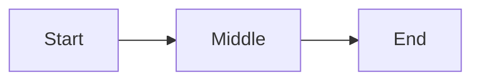

# Markdown → HTML Converter
## Product Specification

**Version:** 0.2
**Date:** May 26, 2026
**Status:** Reconciled to implementation (PRs #1–#9)

---

## 1. Overview

A web application that converts a single markdown document into a styled HTML document. The markdown is generated by an AI instance following a defined spec; the HTML is rendered by the application using a user-selected theme. The markdown stays portable and theme-agnostic. Presentation lives entirely in the application layer.

### 1.1 Core Principle

**Instruct structure, not semantics.** The AI is told only how to organize its output. Visual treatment, color, layout, and typography are decisions made by the application — never by the AI, never embedded in the markdown.

### 1.2 User Flow

1. User prompts an AI instance that has the Markdown Output Guide loaded as a skill
2. AI generates a single markdown document conforming to the spec
3. User uploads the markdown to the converter web app
4. User selects a theme (or applies a saved config)
5. App renders the markdown as themed HTML
6. User can adjust styling via the sidebar, export the result, or save the config

### 1.3 Design Goals

- One markdown document in, one HTML document out
- Markdown stays portable across renderers (works in any standard markdown viewer)
- AI emits minimal, token-efficient markdown with no styling concerns
- Themes are fully decoupled — the same markdown renders correctly in any theme
- Style customization is application-layer only, never markdown-layer

---

## 2. Markdown Specification

The full markdown syntax the AI emits and the converter parses. This is the contract between the AI's output and the converter's input.

### 2.1 Frontmatter

Every document begins with a YAML frontmatter block.

```
---
title: Document Title
tags: [tag1, tag2]
date: YYYY-MM-DD
project: Project Name
purpose: Brief description
---
```

**Required fields:**
- `title` — document title
- `tags` — array of strings (may be empty)

**Optional fields:**
- `date` — ISO 8601 date string
- `project` — project name
- `purpose` — short description of the document's intent

Optional fields render as footer metadata in the HTML output.

### 2.2 Document Structure

| Markdown | Role | Rendered As |
|----------|------|-------------|
| `# Title` | Document title (once, at top) | Captured as `docTitle`; falls back to `frontmatter.title` if omitted |
| `## Section` | Major section | Sidebar tab; section text becomes the tab label and the panel's H1 |
| `### Heading` | Subsection within a section | `<h3>` inside tab content |

H4–H6 are not supported.

**Tab boundary rule:** content between an H2 and the next H2 (or end of document) belongs to that H2's tab. No explicit delimiters are needed.

**Preamble:** any content between the H1 and the first H2 is dropped — per spec discipline, all content lives under H2 sections.

**No H2 case:** a document with no H2 headings gets a single default tab containing all content.

### 2.3 Inline Formatting

| Syntax | Meaning |
|--------|---------|
| `**text**` | Strong emphasis |
| `*text*` | Soft emphasis |
| `~~text~~` | Strikethrough |
| `` `text` `` | Inline code |
| `[text](url)` | Hyperlink |

### 2.4 Lists

Standard markdown lists, including nested lists.

- Unordered: `-`
- Ordered: `1.`
- Task lists: `- [ ]` (incomplete), `- [x]` (complete)

### 2.5 Tables

Standard GFM pipe tables.

```
| Column A | Column B |
|----------|----------|
| Cell     | Cell     |
```

### 2.6 Images

```

```

URL only (no relative paths). The standalone-caption pattern (italic line after an image becoming a `<figcaption>`) is deferred — see §11.

### 2.7 Code Blocks

Fenced code blocks with a language hint.

```
```language
code here
```
```

### 2.8 Color Class System

Four classes are defined: `class1`, `class2`, `class3`, `class4`. The AI chooses which class to apply to which content; the converter applies the theme's color for each class.

Classes are used by callouts, stat cards, mermaid nodes, and linear diagram steps.

### 2.9 Callouts

```
> [!class1]
> Callout content
```

Replace `class1` with any of the four classes.

### 2.10 Stat Cards

Stat cards are grouped in a `stats` fenced block.

```
```stats
:::class1
value: 87%
label: User satisfaction
description: Up 12% from last quarter
:::class2
value: 1.2M
label: Active users
```
```

**Per-card fields:**
- `value` — required
- `label` — required
- `description` — optional

A block may contain one or more cards.

### 2.11 Mermaid Diagrams

Standard mermaid syntax in a fenced block. Nodes may be assigned classes using `:::classN`.

```

```

The renderer injects a `classDef` preamble (see §8.2) so `:::class1`–`:::class4` bind to the active theme's colors automatically.

### 2.12 Linear Diagrams

A simplified linear flow / timeline syntax.

```
```linear
Step 1 :::class1 -> Step 2 :::class2 -> Step 3 :::class3
```
```

Steps are separated by `->`. Each step may optionally be tagged with a class.

### 2.13 Not Supported

The AI is instructed to avoid: H4–H6, blockquotes (other than callouts), footnotes, raw HTML.

---

## 3. Converter Architecture

### 3.1 High-Level Structure

Four logical components:

1. **Parser** — reads markdown, produces a structured intermediate representation (IR)
2. **Renderer** — converts the IR into themed HTML
3. **Theme Engine** — supplies the theme's tokens (colors, fonts) to the renderer
4. **Style Sidebar** — UI for adjusting the active theme's tokens at runtime

### 3.2 Theme-Agnostic Output

The renderer emits a consistent HTML structure regardless of theme. Theme differences are expressed entirely through CSS variables and class-based styling. This enables:

- Live theme switching without re-parsing
- Adding new themes without changing the parser or renderer
- Users saving and restoring custom theme configs

### 3.3 Parse Pipeline

1. Extract and parse frontmatter (YAML via `js-yaml`)
2. Walk the markdown-it token stream
3. Group content under H2 boundaries (tabs)
4. Detect and transform custom block fences (`stats`, `linear`, `mermaid`)
5. Detect callout syntax (`> [!classN]`) and convert to callout tokens
6. Detect task list items (`- [ ]` / `- [x]`) and annotate
7. Return IR: `{ frontmatter, title, tabs: [{ heading, slug, tokens }] }`

### 3.4 Render Output Structure

The rendered HTML follows this structural pattern. Theme stylesheets target the exact class names below.

```html
<div class="layout">
  <aside class="sidebar">
    <div class="brand">
      <div class="brand-name">{title}</div>
    </div>
    <ul class="tab-nav">
      <li>
        <button data-tab="{slug}" class="active">
          <span class="tab-num"></span>{H2 text}
        </button>
      </li>
      ...
    </ul>
  </aside>
  <main class="main">
    <article class="tab-panel active first-tab" id="{slug}" data-tab="{slug}">
      <h1 class="doc-tab-heading">{H2 text}</h1>
      <!-- content -->
    </article>
    ...
    <footer class="doc-footer">
      <div class="meta-item" data-key="date">
        <div class="meta-label">Date</div>
        <div class="meta-value">{date}</div>
      </div>
      <div class="meta-item" data-key="project">...</div>
      <div class="meta-item" data-key="purpose">...</div>
    </footer>
  </main>
</div>
```

**Tab markers.** The `<span class="tab-num"></span>` is emitted empty. Each theme fills it via CSS counter (`counter(md-tab, upper-roman)`, `decimal-leading-zero`, etc.) so marker style stays theme-owned. Themes may also hide `.tab-num` entirely and use `button::before` for a different marker (Terminal does this with `~/`).

### 3.5 Element-Level Rendering

Each markdown construct maps to a stable HTML pattern that all themes share.

**Callouts:**
```html
<div class="callout callout-class1">
  <p>content</p>
</div>
```

**Stat cards:**
```html
<div class="stats">
  <div class="stat-card class1">
    <div class="stat-value">87%</div>
    <div class="stat-label">User satisfaction</div>
    <div class="stat-desc">Up 12% from last quarter</div>
  </div>
  ...
</div>
```

`stat-desc` is omitted when the card has no `description`.

**Linear diagrams:**
```html
<div class="linear">
  <div class="linear-step class1">Step 1</div>
  <div class="linear-step class2">Step 2</div>
  ...
</div>
```

**Mermaid diagrams:**
```html
<div class="mermaid-wrap">
  <div class="mermaid">{source}</div>
</div>
```

Mermaid.js renders client-side and replaces the inner div's text with an inline `<svg>`. The renderer injects a `classDef` preamble (see §8.2) so `:::classN` references in the diagram bind to the active theme's colors.

**Task lists:**
```html
<ul class="task-list">
  <li><span class="task-checkbox"></span><span>Task text</span></li>
  <li class="done"><span class="task-checkbox done"></span><span class="done">Done text</span></li>
</ul>
```

**Standard markdown** (paragraphs, headings, inline emphasis, links, code, tables, ordered/unordered lists, fenced code) renders through markdown-it's default rules — no custom class names are added.

---

## 4. Theme System

### 4.1 Theme as a Token Set

A theme is a structured set of design tokens plus a CSS stylesheet that targets the canonical class skeleton (§3.4, §3.5).

### 4.2 Token Schema

CSS variable names are kebab-case and match the JSON keys 1:1.

```json
{
  "name": "Editorial",
  "mode": "light",
  "colors": {
    "bg": "#F5F1E8",
    "bg-2": "#EFE9DA",
    "bg-3": "#EFE9DA",
    "text": "#1A1612",
    "text-soft": "#4A413A",
    "rule": "#C9BFA8",
    "rule-soft": "#C9BFA8",
    "accent": "#C8553D",
    "class1": "#C8553D",
    "class2": "#588B8B",
    "class3": "#C99846",
    "class4": "#6B4F8F"
  },
  "typography": {
    "font-display": "'DM Serif Display', Georgia, serif",
    "font-body": "'Source Serif 4', Georgia, serif",
    "font-mono": "'JetBrains Mono', monospace"
  },
  "fontsHref": "https://fonts.googleapis.com/css2?..."
}
```

`fontsHref` is optional but every bundled theme provides one.

Themes that don't visually need every color (e.g. Editorial doesn't reference `--bg-3`) simply omit it from their `:root`; the JSON declares the full schema for the style sidebar.

### 4.3 Token Application

Tokens are applied as CSS custom properties on `:root`. Sidebar overrides write to `document.documentElement.style.setProperty('--<name>', value)`, which takes precedence over the theme's `:root` rule.

### 4.4 Bundled Themes

Five themes ship:

1. **Editorial** (light) — magazine/literary aesthetic; DM Serif Display + Source Serif 4
2. **Bauhaus** (light) — Swiss-grid technical; Archivo + IBM Plex
3. **Terminal** (dark) — cyberpunk monospace; Syne + JetBrains Mono
4. **Atelier** (dark) — luxe architectural; Cormorant Garamond + Manrope
5. **Dossier** (dark) — quiet-technical-warm; Fraunces italic numerals + DM Sans

Each theme is `src/themes/<id>/{styles.css, tokens.json}`.

### 4.5 Adding New Themes

1. Create `src/themes/<id>/styles.css` targeting the canonical class skeleton
2. Create `src/themes/<id>/tokens.json` matching the schema in §4.2
3. Add the id to `ThemeId` and register in `src/lib/themes/index.ts`

No changes to parser or renderer.

---

## 5. Style Sidebar

### 5.1 Purpose

The style sidebar lets users adjust the active theme's tokens in real time. Changes apply immediately via CSS variable updates — no re-render required.

### 5.2 Controls

A right-edge slide-in panel toggled by a floating "Style" button (Esc closes).

**Theme** — five swatches (background + accent dot) with active state styling.

**Colors** — one row per canonical color token (12 total: `bg`, `bg-2`, `bg-3`, `text`, `text-soft`, `rule`, `rule-soft`, `accent`, `class1`–`class4`). Each row pairs a native color picker with a hex text input that stay in sync, plus a reset arrow that appears only when the value is overridden.

**Typography** — three font fields: `font-display`, `font-body`, `font-mono`. Each is a grouped `<select>` over a curated face list (every face is preloaded by some bundled theme, so picking any of them works across all themes), plus a "Custom…" option that reveals a free-text input for any CSS `font-family` string.

**Footer actions** — Export HTML / Export config / Import config / Download Markdown Guide / Reset overrides.

Picking a theme clears overrides (fresh start). Reset overrides clears them without changing theme.

**Size sliders** are not yet implemented; deferred per §11.

### 5.3 Live Preview

Color and font edits update the rendered document immediately via inline `:root` style mutations. Mermaid diagrams re-render on theme change and on `class1`–`class4` / `bg` / `text` changes (so their inline SVGs follow the palette).

### 5.4 Config Export and Import

Config shape (see `src/lib/export/json-config.ts`):

```json
{
  "version": 1,
  "theme": "editorial",
  "colorOverrides": { ... },
  "fontOverrides": { ... }
}
```

**Export:** downloads as `md-converter-<theme>.config.json`.
**Import:** file picker; validated against the schema (unknown keys filtered, non-string values dropped, unknown theme rejected).

The same shape is used for localStorage persistence (§8.4).

---

## 6. AI Skill Integration

### 6.1 The Markdown Output Guide

A standalone markdown file (`docs/spec/Markdown Output Guide.md`) is bundled into the app and downloadable from the sidebar. Users load it into their AI tool as a skill, system prompt, or persistent instruction.

### 6.2 Distribution

The guide is imported via Vite's `?raw` at build time so the bundled string is always in sync with the repo source.

### 6.3 Token Efficiency

The guide is intentionally short (~500 tokens) to minimize context overhead. It contains only the syntax rules — no examples beyond minimal demonstrations, no rationale, no styling instructions.

### 6.4 AI Output Contract

When the AI follows the guide, its output:
- Begins with valid YAML frontmatter
- Uses only the markdown constructs defined in §2
- Applies `class1`–`class4` semantically (the AI's choice of which class fits each piece of content)
- Does not include styling values, theme references, or visual instructions

---

## 7. Application Features

### 7.1 Implemented (MVP)

- Live markdown rendering from a hardcoded demo fixture
- Five bundled themes with live switching
- Style sidebar with all controls listed in §5.2 (sizes excepted)
- Config export / import (JSON)
- HTML export (self-contained file with embedded CSS, vanilla tab-switch JS, mermaid pre-rendered to inline SVG)
- Markdown Guide download
- localStorage persistence of theme + overrides

### 7.2 Deferred

- **Drag-and-drop markdown upload UI** (currently the demo is hardcoded)
- **Inline markdown editing** within the app
- **Multi-document projects**
- **URL-based config sharing**
- **Print stylesheet variants**
- **Accessibility audit** (WCAG AA contrast checking on custom configs)
- **Image captions** (italic line following an image → `<figcaption>`)
- **Size sliders** in sidebar (themes hard-code font sizes; would need a refactor to use `--size-*` vars)
- **Mermaid pre-rendering on the server** (currently the HTML export captures already-rendered SVGs from the live DOM)
- **Validation of AI output against the spec** (current behavior: best-effort render; unsupported constructs render as plain text or are ignored by markdown-it)
- **Per-theme construct opt-out** (themes declaring "I don't render mermaid well, skip it")

---

## 8. Technical Considerations

### 8.1 Parser

`markdown-it` in token mode (HTML disabled, linkify enabled), extended with:
- YAML frontmatter extraction via `js-yaml` (browser-safe; replaced gray-matter, which depended on Node's `Buffer`)
- Custom core rules: `callouts`, `stats` fence, `linear` fence, `mermaid` fence, `tasks`
- A tab splitter that walks the token stream and partitions on H2 boundaries

The parser exports the IR shape `{ frontmatter, title, tabs }`. The renderer consumes it via `renderTokens(tokens)` per-tab.

### 8.2 Mermaid Rendering

`mermaid.js` initializes once per session and is invoked via `renderMermaidAll(colors, textColor, themeMode)` which:

1. Walks every `.mermaid` node in the DOM
2. Stores the original source in `data-original` (first call only)
3. Injects a `classDef` preamble that maps `class1`–`class4` to the active theme's colors
4. Calls `mermaid.run({ querySelector: '.mermaid' })` which replaces source with inline SVG

The renderer fires on mount and on theme / class color changes via a Svelte `$effect`, deferred with `requestAnimationFrame` so the CSS swap lands first.

### 8.3 HTML Export

Exported HTML is fully self-contained:
- Inlined `base.css` + active theme CSS + `:root { ... }` override rule
- Google Fonts referenced via `<link>` (not inlined as base64)
- Mermaid diagrams are pulled from the live DOM as already-rendered inline SVG (no mermaid.js runtime in the export)
- Vanilla tab-switch JS for click-to-switch behavior (no SvelteKit hydration needed)
- No external CSS or JS dependencies beyond Google Fonts

Pipeline (`src/lib/export/html-export.ts`):
1. Caller hands in the live `.layout.outerHTML`
2. Wrap with `<head>` containing inlined CSS + fonts link
3. Append `<script>` block with the tab-switch JS

Implication: the export reflects whatever overrides are active at export time.

### 8.4 State Persistence

Active theme + color overrides + font overrides persist to `localStorage` under `md-converter-config-v1`, using the same JSON shape as config export (§5.4). Restore runs once on mount; save fires on every state change. Wrapped in try/catch so a full or disabled localStorage degrades silently.

---

## 9. Open Questions

Resolved during build (PRs #1–#9):

- ~~Should mermaid be pre-rendered server-side?~~ — No. Live mermaid renders client-side; the HTML export captures the rendered SVGs from the live DOM at export time.
- ~~What happens if the AI emits an unsupported construct?~~ — markdown-it renders it as best-effort (often as plain text); we don't validate or warn.
- ~~Validate or render best-effort?~~ — Best-effort.

Still open:

- Should themes be able to declare incompatible constructs they don't render well? (e.g., a minimalist theme that skips diagrams entirely)
- Should the exported HTML inline Google Fonts as base64 for true offline portability, or is a Google Fonts CDN link acceptable?
- Should the size sliders be added once themes are refactored to use `--size-*` vars, or dropped from the spec entirely?

---

## 10. Glossary

**Class (class1–class4):** One of four semantic color buckets used across callouts, stat cards, and diagrams. The AI assigns classes; the theme assigns colors to classes.

**Config:** A saved set of `{ theme, colorOverrides, fontOverrides }`. Exportable as JSON; identical shape lives in localStorage.

**Guide:** The markdown specification document (`docs/spec/Markdown Output Guide.md`) provided to the AI as a skill.

**IR (Intermediate Representation):** The parsed structure `{ frontmatter, title, tabs }` produced by the parser and consumed by the renderer.

**Tab:** A section of the document delimited by H2 headings, rendered as a sidebar nav item.

**Theme:** A complete visual treatment — colors, fonts, CSS — that can be applied to any conforming markdown document.

**Token:** A single design variable (e.g., `accent` color, `font-body`) defined by a theme and editable via the style sidebar.

---

## 11. Implementation Status (PRs #1–#9)

| PR | Subject |
|----|---------|
| #1 | Scaffold SvelteKit + adapter-static + Prettier |
| #2 | Parser pipeline: frontmatter, custom plugins, tab splitter |
| #3 | Canonical renderer + Svelte layout components |
| #4 | Extract 4 bundled themes + runtime swap |
| #5 | Dossier (5th theme) from alt-style spec |
| #6 | Browser-safe frontmatter (gray-matter → js-yaml) |
| #7 | Style sidebar: theme + color + font controls |
| #8 | Config + HTML export + live mermaid |
| #9 | localStorage persistence + Markdown Guide download |

Source layout:

```
src/
  routes/+page.svelte           App shell: state, effects, demo fixture
  lib/
    parser/                     markdown-it + plugins + tab splitter → IR
    renderer/                   HTML renderer + Svelte layout + mermaid + base.css
    themes/                     Theme registry; per-theme CSS+JSON under src/themes/
    sidebar/                    StyleSidebar component + curated font list
    export/                     JSON config + HTML export helpers
    fixtures/                   demo.md
docs/spec/                      This file + Markdown Output Guide + reference HTML templates
```

Test surface: 40 vitest cases across parser (frontmatter, slug, tab splitting, each custom plugin), renderer (each custom HTML rule), and config (round-trip, validation, key filtering).
