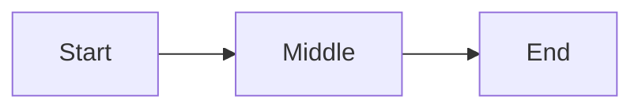

# Markdown → HTML Converter
## Product Specification

**Version:** 0.1
**Date:** May 25, 2026
**Status:** Draft

---

## 1. Overview

A web application that converts a single markdown document into a styled HTML document. The markdown is generated by an AI instance following a defined spec; the HTML is rendered by the application using a user-selected theme. The markdown stays portable and theme-agnostic. Presentation lives entirely in the application layer.

### 1.1 Core Principle

**Instruct structure, not semantics.** The AI is told only how to organize its output. Visual treatment, color, layout, and typography are decisions made by the application — never by the AI, never embedded in the markdown.

### 1.2 User Flow

1. User prompts an AI instance that has the Markdown Output Guide loaded as a skill
2. AI generates a single markdown document conforming to the spec
3. User uploads the markdown to the converter web app
4. User selects a theme (or applies a saved config)
5. App renders the markdown as themed HTML
6. User can adjust styling via the sidebar, export the result, or save the config

### 1.3 Design Goals

- One markdown document in, one HTML document out
- Markdown stays portable across renderers (works in any standard markdown viewer)
- AI emits minimal, token-efficient markdown with no styling concerns
- Themes are fully decoupled — the same markdown renders correctly in any theme
- Style customization is application-layer only, never markdown-layer

---

## 2. Markdown Specification

The full markdown syntax the AI emits and the converter parses. This is the contract between the AI's output and the converter's input.

### 2.1 Frontmatter

Every document begins with a YAML frontmatter block.

```
---
title: Document Title
tags: [tag1, tag2]
date: YYYY-MM-DD
project: Project Name
purpose: Brief description
---
```

**Required fields:**
- `title` — document title
- `tags` — array of strings (may be empty)

**Optional fields:**
- `date` — ISO 8601 date string
- `project` — project name
- `purpose` — short description of the document's intent

Optional fields render as footer metadata in the HTML output.

### 2.2 Document Structure

| Markdown | Role | Rendered As |
|----------|------|-------------|
| `# Title` | Document title (once, at top) | Document headline |
| `## Section` | Major section | Sidebar tab |
| `### Heading` | Subsection within a section | Section heading inside tab content |

H4–H6 are not supported.

**Tab boundary rule:** content between an H2 and the next H2 (or end of document) belongs to that H2's tab. No explicit delimiters are needed.

### 2.3 Inline Formatting

| Syntax | Meaning |
|--------|---------|
| `**text**` | Strong emphasis |
| `*text*` | Soft emphasis |
| `~~text~~` | Strikethrough |
| `` `text` `` | Inline code |
| `[text](url)` | Hyperlink |

### 2.4 Lists

Standard markdown lists, including nested lists.

- Unordered: `-`
- Ordered: `1.`
- Task lists: `- [ ]` (incomplete), `- [x]` (complete)

### 2.5 Tables

Standard GFM pipe tables with optional column alignment.

```
| Column A | Column B |
|----------|----------|
| Cell     | Cell     |
```

### 2.6 Images

```

*Caption text*
```

URL only (no relative paths). An optional italic line immediately following the image is treated as a caption.

### 2.7 Code Blocks

Fenced code blocks with a language hint.

```
```language
code here
```
```

### 2.8 Color Class System

Four classes are defined: `class1`, `class2`, `class3`, `class4`. The AI chooses which class to apply to which content; the converter applies the theme's color for each class.

Classes are used by callouts, stat cards, mermaid nodes, and linear diagram steps.

### 2.9 Callouts

```
> [!class1]
> Callout content
```

Replace `class1` with any of the four classes.

### 2.10 Stat Cards

Stat cards are grouped in a `stats` fenced block.

```
```stats
:::class1
value: 87%
label: User satisfaction
description: Up 12% from last quarter
:::class2
value: 1.2M
label: Active users
```
```

**Per-card fields:**
- `value` — required
- `label` — required
- `description` — optional

A block may contain one or more cards.

### 2.11 Mermaid Diagrams

Standard mermaid syntax in a fenced block. Nodes may be assigned classes using `:::classN`.

```

```

### 2.12 Linear Diagrams

A simplified linear flow / timeline syntax.

```
```linear
Step 1 :::class1 -> Step 2 :::class2 -> Step 3 :::class3
```
```

Steps are separated by `->`. Each step may optionally be tagged with a class.

### 2.13 Not Supported

The AI is instructed to avoid: H4–H6, blockquotes (other than callouts), footnotes, raw HTML.

---

## 3. Converter Architecture

### 3.1 High-Level Structure

The application has four logical components:

1. **Parser** — reads markdown, produces a structured intermediate representation
2. **Renderer** — converts the IR into themed HTML
3. **Theme Engine** — supplies the theme's tokens (colors, fonts, type sizes, spacing) to the renderer
4. **Style Sidebar** — UI for adjusting the active theme's tokens at runtime

### 3.2 Theme-Agnostic Output

The renderer emits a consistent HTML structure regardless of theme. Theme differences are expressed entirely through CSS variables and class-based styling. This enables:

- Live theme switching without re-parsing
- Adding new themes without changing the parser or renderer
- Users saving and restoring custom theme configs

### 3.3 Parse Pipeline

1. Extract and parse frontmatter (YAML)
2. Walk the markdown AST
3. Group content under H2 boundaries (tabs)
4. Detect and parse custom block fences (`stats`, `linear`, `mermaid`)
5. Detect callout syntax (`> [!classN]`) and convert to callout nodes
6. Build the IR

### 3.4 Render Output Structure

The rendered HTML follows this structural pattern. Theme implementations apply their own CSS to this structure.

```
<div class="doc-layout">
  <aside class="doc-sidebar">
    <div class="doc-brand">{title}</div>
    <ul class="doc-tabs">
      <li><button data-tab="..." class="active">{H2 text}</button></li>
      ...
    </ul>
  </aside>
  <main class="doc-main">
    <article class="doc-tab-panel active" id="...">
      <h1>{title from frontmatter or first H1}</h1>
      <!-- content -->
    </article>
    ...
    <footer class="doc-footer">
      <div class="doc-meta" data-key="date">{date}</div>
      <div class="doc-meta" data-key="project">{project}</div>
      <div class="doc-meta" data-key="purpose">{purpose}</div>
    </footer>
  </main>
</div>
```

### 3.5 Element-Level Rendering

Each markdown construct maps to a stable HTML pattern that all themes share.

**Callouts:**
```
<div class="doc-callout doc-callout-class1">
  <div class="doc-callout-content">...</div>
</div>
```

**Stat cards:**
```
<div class="doc-stats">
  <div class="doc-stat doc-stat-class1">
    <div class="doc-stat-value">87%</div>
    <div class="doc-stat-label">User satisfaction</div>
    <div class="doc-stat-desc">Up 12% from last quarter</div>
  </div>
  ...
</div>
```

**Linear diagrams:**
```
<div class="doc-linear">
  <div class="doc-linear-step doc-linear-class1">Step 1</div>
  <div class="doc-linear-step doc-linear-class2">Step 2</div>
  ...
</div>
```

**Mermaid diagrams:** rendered client-side by mermaid.js. The renderer emits a `<div class="doc-mermaid">` wrapper with the mermaid source inside, plus a `classDef` block injected at the top of the diagram code that maps `class1`–`class4` to the theme's current colors.

**Images with captions:**
```
<figure class="doc-figure">
  
  <figcaption>Caption text</figcaption>
</figure>
```

**Task lists:**
```
<ul class="doc-task-list">
  <li class="doc-task done"><span class="doc-task-check"></span>Task text</li>
  ...
</ul>
```

---

## 4. Theme System

### 4.1 Theme as a Token Set

A theme is a structured set of design tokens. Each theme defines values for the same set of variables; only the values differ.

### 4.2 Token Schema

```
{
  "name": "string",
  "mode": "light" | "dark",
  "colors": {
    "background": "hex",
    "background_alt": "hex",
    "text": "hex",
    "text_soft": "hex",
    "rule": "hex",
    "accent": "hex",
    "class1": "hex",
    "class2": "hex",
    "class3": "hex",
    "class4": "hex"
  },
  "typography": {
    "font_display": "css font-family stack",
    "font_body": "css font-family stack",
    "font_mono": "css font-family stack",
    "size_title": "px or rem",
    "size_section": "px or rem",
    "size_heading": "px or rem",
    "size_body": "px or rem"
  }
}
```

### 4.3 Token Application

Tokens are applied as CSS custom properties on the document root. Theme styles reference them rather than hard-coding values.

```
:root {
  --bg: #14110D;
  --text: #E8DFD0;
  --accent: #C9A961;
  --class1: #C9A961;
  /* ... */
}
```

### 4.4 Bundled Themes

The app ships with four themes:

1. **Editorial** (light) — magazine/literary aesthetic
2. **Bauhaus** (light) — Swiss-grid technical aesthetic
3. **Terminal** (dark) — cyberpunk monospace aesthetic
4. **Atelier** (dark) — luxe architectural aesthetic

Each theme provides its own complete CSS stylesheet, written against the shared HTML structure defined in §3.4 and §3.5.

### 4.5 Adding New Themes

A new theme requires:
- A token JSON file
- A CSS stylesheet implementing the shared HTML structure
- A preview thumbnail (optional but recommended)

No changes to the parser or renderer are needed.

---

## 5. Style Sidebar

### 5.1 Purpose

The style sidebar lets users adjust the active theme's tokens in real time. Changes apply immediately via CSS variable updates — no re-render required.

### 5.2 Controls

The sidebar exposes:

**Theme selector** — dropdown or grid of the four bundled themes plus any user-imported configs

**Colors** — color pickers for:
- Background
- Text
- Accent
- Class 1
- Class 2
- Class 3
- Class 4

**Typography** — font selectors for:
- Display font (used for title and sections)
- Body font (used for headings and body text)

Font selection draws from a curated list (Google Fonts subset) or accepts a custom CSS font-family value.

**Text sizes** — numeric inputs for:
- Title
- Section
- Heading
- Body

### 5.3 Live Preview

All changes update the rendered document in real time as the user adjusts controls.

### 5.4 Config Export and Import

**Export:** the current token set serializes to JSON. User can download the file or copy it to clipboard.

**Import:** user uploads a previously exported JSON file. The app loads the tokens as the active theme.

This allows users to:
- Save personalized themes for reuse
- Share theme configs with others
- Build a library of brand-specific configs

---

## 6. AI Skill Integration

### 6.1 The Markdown Output Guide

A standalone markdown file (the spec defined in §2) is provided as a downloadable artifact. Users load it into their AI tool as a skill, system prompt, or persistent instruction.

### 6.2 Distribution

The guide is available from the app as a one-click download. It is also versioned alongside the app so users can confirm they have the current version.

### 6.3 Token Efficiency

The guide is intentionally short (~500 tokens) to minimize context overhead. It contains only the syntax rules — no examples beyond minimal demonstrations, no rationale, no styling instructions.

### 6.4 AI Output Contract

When the AI follows the guide, its output:
- Begins with valid YAML frontmatter
- Uses only the markdown constructs defined in §2
- Applies `class1`–`class4` semantically (the AI's choice of which class fits each piece of content)
- Does not include styling values, theme references, or visual instructions

---

## 7. Application Features (MVP)

### 7.1 Required

- Markdown file upload (drag-and-drop or file picker)
- Live HTML preview
- Theme selection (four bundled themes)
- Style sidebar with all controls listed in §5.2
- Config export and import (JSON)
- HTML export (self-contained file with embedded styles)
- Markdown guide download

### 7.2 Deferred to Post-MVP

- Inline markdown editing within the app
- Multi-document projects
- URL-based config sharing
- Additional bundled themes
- Print stylesheet variants
- Accessibility audit and adjustments (WCAG AA contrast checking on custom configs)

---

## 8. Technical Considerations

### 8.1 Parser

A standard CommonMark/GFM-compliant markdown parser, extended with:
- Custom fence block handlers (`stats`, `linear`)
- Obsidian-style callout detection (`> [!classN]`)
- Frontmatter extraction (YAML)

Recommended: `markdown-it` or `remark` with custom plugins.

### 8.2 Mermaid Rendering

Mermaid.js is loaded and initialized client-side. The renderer injects a `classDef` block at the top of each mermaid source that maps `class1`–`class4` to the active theme's current color values.

### 8.3 HTML Export

Exported HTML is fully self-contained:
- Theme CSS inlined in a `<style>` tag
- Mermaid pre-rendered to inline SVG (no runtime dependency)
- Fonts referenced via Google Fonts CDN or inlined as base64 (user choice)
- No external CSS or JS dependencies

### 8.4 State Persistence

The active theme and config persist in browser local storage so users return to their last setup.

---

## 9. Open Questions

- Should mermaid diagrams be pre-rendered server-side for faster initial paint?
- What happens if the AI emits an unsupported construct? (Silently strip? Render as plain text? Show a warning?)
- Should the converter validate the markdown against the spec and surface errors, or render best-effort?
- Should themes be able to declare incompatible markdown constructs they don't render well? (E.g., a minimalist theme that skips diagrams entirely.)

---

## 10. Glossary

**Class (class1–class4):** One of four semantic color buckets used across callouts, stat cards, and diagrams. The AI assigns classes; the theme assigns colors to classes.

**Config:** A saved set of theme tokens (colors, fonts, sizes). Can be exported and imported as JSON.

**Guide:** The markdown specification document provided to the AI as a skill.

**IR (Intermediate Representation):** The parsed structure produced by the parser and consumed by the renderer.

**Tab:** A section of the document delimited by H2 headings, rendered as a sidebar nav item.

**Theme:** A complete visual treatment — colors, fonts, type sizes, layout patterns, and CSS — that can be applied to any conforming markdown document.

**Token:** A single design variable (e.g., `accent` color, `font_body`) defined by a theme.
