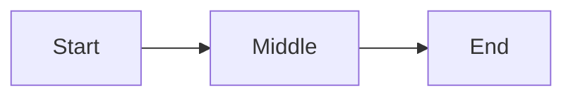

# themed-markdown

Output = one .md file. A web app renders it as themed HTML. **Job = structure. Styling = app's job — never include visual instructions.**

## When

Default for any structured doc (doc/spec/RFC/ADR/report/brief/plan/runbook/summary). Skip for: code-only, one-liners, chat, scratch.

## Contract

Output:
- starts with valid YAML frontmatter
- uses only constructs below
- applies `class1`–`class4` semantically (you pick which fits)
- never names colors, fonts, sizes, themes, or visual treatments

## Legend

- `req` = required, `opt` = optional
- `≤N` = soft cap, N characters. Over-cap → wraps awkwardly or overflows a fixed UI slot.

## 1 · Frontmatter

```
---
title: Document Title
tags: [tag1, tag2]
date: YYYY-MM-DD
project: Project Name
purpose: Brief description
---
```

| Field | Status | Cap |
|---|---|---|
| `title` | req | ≤40 |
| `tags` | req (list; `[]` ok) | — |
| `date` | opt | `YYYY-MM-DD` |
| `project` | opt | ≤40 |
| `purpose` | opt | ≤40 |

`date`/`project`/`purpose` → footer meta cards.

## 2 · Structure

| Syntax | Role | Cap |
|---|---|---|
| `# Title` | doc title (opt; falls back to `frontmatter.title`) | — |
| `## Section` | sidebar tab | ≤28 |
| `### Heading` | subsection → `<h3>` | ≤80 |

H4–H6 ⛔.

**Tab rule:** every H2 = one tab. Content between two H2s belongs to the first. Content between H1 and first H2 is **silently dropped** — put intro under an H2 (e.g. "Overview").

Single-section docs may omit H2s; whole doc = one tab.

**Doc scale:** the app renders every section up-front and re-renders every Mermaid on each tab switch. Aim for ≤25 sections and ≤15 Mermaid diagrams; split larger material.

## 3 · Inline

`**bold**` · `*italic*` · `~~strike~~` · `` `code` `` · `[text](url)`

## 4 · Lists

`-` unordered · `1.` ordered · `- [ ]` / `- [x]` tasks

## 5 · Tables

Standard GFM pipe tables.

```
| Col A | Col B |
|-------|-------|
| Cell  | Cell  |
```

## 6 · Images

```

```

Absolute URLs only. Descriptive alt text.

## 7 · Code blocks

Fenced with a language hint:

````
```language
code
```
````

## 8 · Color classes

`class1`–`class4`. Available on callouts, stat cards, mermaid nodes, linear steps. **You choose which class fits each piece based on meaning** — the theme decides the actual colors.

Pattern: one class per semantic role across the doc (e.g. `class1` = primary, `class2` = supporting, `class3` = positive/done, `class4` = caution/warning). Consistency > specific choice.

## 9 · Callouts

```
> [!class1]
> Callout content.
```

Cap: ≤280 (one short paragraph). Class1–class4.

## 10 · Stat cards

````
```stats
:::class1
value: 87%
label: User satisfaction
description: Up 12% from last quarter
:::class2
value: 1.2M
label: Active users
:::class3
value: 4.8
label: App rating
```
````

| Field | Status | Cap | Notes |
|---|---|---|---|
| `value` | req | ≤12 | Short token: `87%`, `1.2M`, `Editorial`. Not sentences. |
| `label` | req | ≤28 | One short noun phrase. |
| `description` | opt | one short line | Omit if no signal. |

Layout: 2 per row; trailing odd card spans the row.

## 11 · Mermaid

````

````

Class via `:::classN` on nodes. The app injects `classDef` — don't write `classDef`, `fill:`, or any style directive.

Node label cap: ≤24 (Mermaid auto-sizes nodes to fit; long labels balloon them).

## 12 · Linear

````
```linear
Step 1 :::class1 -> Step 2 :::class2 -> Step 3 :::class3
```
````

Steps separated by `->`, optional class via `:::classN`. Steps render **vertically** — one per row, top→bottom (never horizontal). Step text cap: ≤48.

## 13 · Never

- H4–H6
- Blockquotes (except callouts)
- Footnotes
- Raw HTML
- Color/font/size/theme/visual mentions
- Content between H1 and first H2 → silently dropped. Use an H2 ("Overview").
- Comma-separated `tags` → must be a YAML list. `tags: [a, b]` or `tags: []`. Never `tags: a, b`.

---

## Minimal example

```markdown
---
title: Quarterly Review
tags: [q1, summary]
date: 2026-03-31
project: Apollo
purpose: One-page summary of Q1 outcomes
---

# Quarterly Review

## Headline

We hit the targets we set in January. A few risks for Q2 follow.

> [!class3]
> All three primary KPIs landed above target. No surprises in the operational data.

## Numbers

```stats
:::class3
value: 87%
label: On-time delivery
description: Up from 74% in Q4
:::class1
value: 1,240
label: New customers
:::class4
value: 2
label: P1 incidents
description: Both resolved within 4h
```

## What's next

```linear
Q2 plan :::class1 -> Hiring :::class2 -> Migration :::class3 -> Ship :::class4
```

### Risks

- [ ] Vendor renewal slipping
- [x] Compliance audit completed
- [ ] Hiring backfill
```
