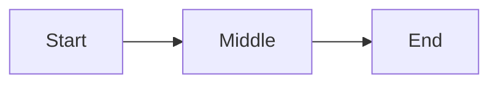

# themed-markdown

Output documents in this format. The document is one markdown file; a separate web app turns it into themed HTML. **Your job is structure; styling is the app's job — never include visual instructions in the output.**

## When to use

Default format for **any structured doc**: doc, docs, spec, specs, design doc, RFC, ADR, report, brief, plan, runbook, summary, write-up, project notes. If the user is asking for a document longer than a paragraph or two, use this.

Skip for: code-only answers, one-line replies, chat-flow conversation, throwaway scratch.

## Output contract

When you follow this skill, your output:

- Starts with valid YAML frontmatter
- Uses only the constructs defined below
- Applies `class1`–`class4` semantically (your choice of which class fits each piece of content)
- Does **not** include styling values, theme references, font names, color names, or visual instructions

## 1 · Frontmatter

Every document begins with:

```
---
title: Document Title
tags: [tag1, tag2]
date: YYYY-MM-DD
project: Project Name
purpose: Brief description
---
```

`title` and `tags` are required (`tags` may be empty: `[]`). `date`, `project`, `purpose` are optional. Optional fields render as footer metadata.

## 2 · Structure

| Level | Use | Notes |
|---|---|---|
| `# Title` | Document title, once at top | Optional — falls back to `frontmatter.title` |
| `## Section` | Major section | Becomes a sidebar tab |
| `### Heading` | Subsection inside a section | Renders as `<h3>` |

H4–H6 are not supported. Don't use them.

**Every H2 is a tab.** Content between an H2 and the next H2 belongs to that tab. Content before the first H2 is dropped — put nothing between the H1 and the first H2.

If the document has only one section, you may omit H2s; the whole doc renders as one tab.

## 3 · Inline formatting

- `**bold**` — strong emphasis
- `*italic*` — soft emphasis
- `~~strike~~` — removed / deprecated content
- `` `code` `` — technical terms, filenames, UI labels
- `[text](https://url.com)` — links

## 4 · Lists

- Unordered with `-`
- Ordered with `1.`
- Task lists with `- [ ]` (incomplete) and `- [x]` (complete)

## 5 · Tables

Standard GFM pipe tables.

```
| Column A | Column B |
|----------|----------|
| Cell     | Cell     |
```

## 6 · Images

```

```

URL only — no relative paths. Use descriptive alt text.

## 7 · Code blocks

Fenced with a language hint:

````
```language
code here
```
````

## 8 · Color classes

Four classes are available: `class1`, `class2`, `class3`, `class4`. Use them on callouts, stat cards, mermaid nodes, and linear diagram steps. **You choose which class fits each piece of content based on its meaning** — the theme decides what those four colors actually look like.

A common pattern: pick one class per semantic role consistently across the doc (e.g. `class1` = primary subject, `class2` = supporting / cross-reference, `class3` = positive / done, `class4` = caution / warning). Consistency matters more than which specific class you pick.

## 9 · Callouts

```
> [!class1]
> Callout content goes here.
```

Replace `class1` with any of the four classes. Keep callouts short — one short paragraph is typical.

## 10 · Stat cards

Group one or more stat cards in a single `stats` block:

````
```stats
:::class1
value: 87%
label: User satisfaction
description: Up 12% from last quarter
:::class2
value: 1.2M
label: Active users
:::class3
value: 4.8
label: App rating
```
````

`value` and `label` are required per card. `description` is optional. Use them for at-a-glance numeric summaries.

## 11 · Mermaid diagrams

Apply classes to nodes with `:::classN`:

````

````

The app injects a `classDef` preamble that binds `class1`–`class4` to the active theme's colors — you don't need to (and should not) include any `classDef`, `fill:`, or other style directives.

## 12 · Linear diagrams

Simple linear flow / timeline. Steps separated by `->`, each optionally tagged with a class:

````
```linear
Step 1 :::class1 -> Step 2 :::class2 -> Step 3 :::class3
```
````

## 13 · Do not use

- H4–H6
- Blockquotes (other than callouts)
- Footnotes
- Raw HTML
- Any indication of color, font, size, theme, or visual treatment
- **Content between the H1 and the first H2** — it will be silently dropped. Put intro material under a tab (e.g. an H2 called "Overview").
- **Comma-separated tags** — `tags` must be a YAML list, not a string. Use `tags: [alpha, beta]` or `tags: []`, never `tags: alpha, beta`.

---

## Minimal example

```markdown
---
title: Quarterly Review
tags: [q1, summary]
date: 2026-03-31
project: Apollo
purpose: One-page summary of Q1 outcomes
---

# Quarterly Review

## Headline

We hit the targets we set in January. A few risks for Q2 follow.

> [!class3]
> All three primary KPIs landed above target. No surprises in the operational data.

## Numbers

```stats
:::class3
value: 87%
label: On-time delivery
description: Up from 74% in Q4
:::class1
value: 1,240
label: New customers
:::class4
value: 2
label: P1 incidents
description: Both resolved within 4h
```

## What's next

```linear
Q2 plan :::class1 -> Hiring :::class2 -> Migration :::class3 -> Ship :::class4
```

### Risks

- [ ] Vendor renewal slipping
- [x] Compliance audit completed
- [ ] Hiring backfill
```
