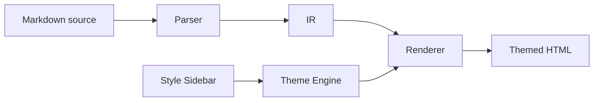

# md-converter — Product Specification

## Overview

A web app that turns a single AI-authored markdown document into a styled HTML document. The markdown is portable and theme-agnostic. Presentation lives entirely in the application layer.

### Core principle

> [!class1]
> **Instruct structure, not semantics.** The AI is told only how to *organize* its output. Visual treatment — color, layout, typography — is the application's job. Never embedded in the markdown.

### User flow

```linear
Prompt AI :::class1 -> Generate markdown :::class2 -> Upload to converter :::class3 -> Pick theme :::class3 -> Render + export :::class3
```

### Design goals

- One markdown document in, one HTML document out
- Markdown stays portable — works in any standard renderer
- AI emits minimal, token-efficient markdown with **no styling concerns**
- Themes are fully decoupled — same markdown, any theme
- Style customization is application-layer only

### By the numbers

```stats
:::class1
value: 5
label: Bundled themes
description: Editorial, Bauhaus, Terminal, Atelier, Dossier
:::class2
value: 12
label: Color tokens
description: Per theme, editable in sidebar
:::class3
value: 40
label: Vitest cases
description: Parser + renderer + config
:::class4
value: 14
label: Markdown constructs
description: Defined in §2 of the source spec
```

## Markdown contract

The syntax the AI emits and the converter parses. This is the contract — both sides must agree.

### Frontmatter

Every document begins with YAML frontmatter. `title` and `tags` are required (`tags` may be `[]`). `date`, `project`, `purpose` are optional and render as footer metadata.

```
---
title: Document Title
tags: [tag1, tag2]
date: YYYY-MM-DD
project: Project Name
purpose: Brief description
---
```

### Document structure

| Level | Use | Notes |
|---|---|---|
| `# Title` | Document title, once at top | Optional — falls back to `frontmatter.title` |
| `## Section` | Major section | Becomes a sidebar tab |
| `### Heading` | Subsection inside a section | Renders as `<h3>` |

H4–H6 are not supported. Don't use them.

> [!class4]
> **Preamble is dropped.** Content between the H1 and the first H2 disappears. Put nothing there. All content lives under H2 sections.

### Inline + lists + tables

Standard markdown for **bold**, *italic*, `code`, `~~strike~~`, `[link](https://x)`. Standard GFM pipe tables. Task lists with `- [ ]` and `- [x]`.

### Color classes

Four classes: `class1`, `class2`, `class3`, `class4`. The AI picks which class fits each piece of content based on *meaning*; the theme picks the actual colors. Use them on **callouts**, **stat cards**, **mermaid nodes**, and **linear diagram steps**.

A common convention: one class per semantic role, used consistently across the doc.

### Callouts, stats, mermaid, linear

Each of these is a fenced block with its own micro-syntax — `> [!classN]`, ` ```stats `, ` ```mermaid `, ` ```linear `. See the source spec §2.9–§2.12 for the exact shapes.

### Not supported

H4–H6, blockquotes (other than callouts), footnotes, raw HTML.

## Architecture

Four logical components, separable and individually replaceable.

### Components



### Parse pipeline

1. Extract + parse frontmatter (`js-yaml`)
2. Walk the `markdown-it` token stream
3. Group content under H2 boundaries (tabs)
4. Transform custom fences (`stats`, `linear`, `mermaid`)
5. Detect callout syntax (`> [!classN]`) and convert
6. Detect task list items and annotate
7. Return IR: `{ frontmatter, title, tabs: [{ heading, slug, tokens }] }`

### Render output structure

The renderer emits the canonical class skeleton regardless of theme. Themes target these exact classes — no `doc-` prefix, no per-theme variants.

```
.layout > .sidebar (.brand, .tab-nav) + .main (.tab-panel*, .doc-footer)
```

Element-level: `.callout.callout-classN`, `.stats > .stat-card.classN`, `.linear > .linear-step.classN`, `.mermaid-wrap > .mermaid`, `.task-list > li (.done)?`.

## Themes

Five themes ship. Each is a `styles.css` + `tokens.json` under `src/themes/<id>/`.

### Bundled themes

```stats
:::class1
value: Editorial
label: Light · magazine
description: DM Serif Display + Source Serif 4
:::class2
value: Bauhaus
label: Light · Swiss-grid
description: Archivo + IBM Plex
:::class3
value: Terminal
label: Dark · monospace
description: Syne + JetBrains Mono
:::class4
value: Atelier
label: Dark · architectural
description: Cormorant Garamond + Manrope
```

Plus **Dossier** — dark, quiet-technical-warm, Fraunces italic numerals, derived from the alt-style reference doc in `docs/spec/templates/alternate style/`.

### Token schema

CSS variable names are kebab-case, matching the JSON keys 1:1. Colors: `bg`, `bg-2`, `bg-3`, `text`, `text-soft`, `rule`, `rule-soft`, `accent`, `class1–class4`. Typography: `font-display`, `font-body`, `font-mono`. Optional `fontsHref` for Google Fonts.

### Adding new themes

1. Create `src/themes/<id>/styles.css` against the canonical class skeleton
2. Create `src/themes/<id>/tokens.json`
3. Register in `src/lib/themes/index.ts` and add the id to `ThemeId`

No changes to parser or renderer.

## Style sidebar

A right-edge slide-in panel toggled by a floating **Style** button (Esc closes). Lets users adjust the active theme's tokens in real time — changes apply immediately via CSS variable updates, no re-render needed.

### Controls

- **Theme** — 5 swatches with active state
- **Colors** — one row per canonical token (12). Native picker + hex input in sync, per-row reset arrow
- **Typography** — 3 font fields. Grouped `<select>` over curated faces + `Custom…` text input

### Actions

```linear
Upload markdown :::class1 -> Export HTML :::class3 -> Export/Import config :::class2 -> Download Skill :::class2 -> Reset overrides :::class4
```

Picking a theme clears overrides — fresh start.

### Config shape

Same JSON shape is used for config import/export and for localStorage persistence:

```json
{
  "version": 1,
  "theme": "editorial",
  "colorOverrides": { ... },
  "fontOverrides": { ... }
}
```

## AI skill

The output guide is bundled as a **Claude-format skill** with `name: themed-markdown` and a trigger-rich description that auto-invokes on generic doc-writing language.

### Distribution

`docs/spec/themed-markdown.skill.md` is imported via Vite's `?raw` at build time, so the bundled string is always in sync with the repo source. Sidebar action **Download Skill for AI** downloads it.

### When the skill fires

> [!class2]
> Triggers on: *doc, docs, spec, specs, design doc, RFC, ADR, report, brief, plan, runbook, summary, write-up.* Default for any structured doc longer than a paragraph. Skips: code-only answers, one-liners, chat-flow, scratch.

### Token efficiency

The skill body is ~700 tokens including a minimal example. Just syntax rules, when-to-use triggers, output contract — no styling instructions.

## Features

### Implemented (MVP)

- [x] Live markdown rendering with theme switching
- [x] Five bundled themes
- [x] Style sidebar — 12 colors + 3 fonts, all live
- [x] Config export / import (JSON)
- [x] HTML export (self-contained, mermaid pre-rendered to inline SVG)
- [x] Markdown upload via system file picker
- [x] Skill download for AI
- [x] localStorage persistence

### Deferred

- [ ] Drag-and-drop upload (file picker only for now)
- [ ] Inline markdown editing in the app
- [ ] Multi-document projects
- [ ] URL-based config sharing
- [ ] Print stylesheet variants
- [ ] Accessibility audit (WCAG AA contrast on custom configs)
- [ ] Image captions (italic line → `<figcaption>`)
- [ ] Size sliders in sidebar (needs themes refactored to `--size-*` vars)
- [ ] Spec-validation of AI output
- [ ] Per-theme construct opt-out

## Technical notes

### Parser

`markdown-it` in token mode (HTML disabled, linkify enabled), extended with:

- YAML frontmatter via `js-yaml` (browser-safe; replaced gray-matter, which depended on Node's `Buffer`)
- Custom core rules: `callouts`, `stats`/`linear`/`mermaid` fences, `tasks`
- Tab splitter — partitions the token stream on H2 boundaries

### Mermaid rendering

`mermaid.js` initializes once per session. `renderMermaidAll(colors, textColor, themeMode)`:

1. Walks every `.mermaid` node
2. Stores original source in `data-original` (first call only)
3. Injects a `classDef` preamble binding `class1`–`class4` to active theme colors
4. Calls `mermaid.run()` — replaces source with inline SVG

Re-fires on theme + class-color + IR changes via Svelte `$effect`, deferred with `requestAnimationFrame` so the CSS swap lands first.

### HTML export

Exported HTML is fully self-contained:

- Inlined `base.css` + active theme CSS + `:root { ... }` override rule
- Google Fonts via `<link>` (not inlined as base64 — open question)
- Mermaid diagrams pulled from the live DOM as already-rendered SVG (no mermaid.js runtime in the export)
- Vanilla tab-switch JS (no SvelteKit hydration needed)

### State persistence

Active theme + color overrides + font overrides persist to `localStorage` under `md-converter-config-v1`, same JSON shape as config export. Restore once on mount; save on every change. Try/catch so a full or disabled localStorage degrades silently.

## Status

### Open questions

> [!class4]
> Per-theme construct opt-out — should a minimalist theme be able to declare "I don't render mermaid well, skip it"?

> [!class4]
> Inline Google Fonts as base64 for offline portability, or leave the CDN `<link>`?

> [!class4]
> Size sliders — add once themes use `--size-*` vars, or drop from spec?

### Build history

```stats
:::class3
value: 12
label: PRs merged
description: Scaffold → spec reconcile + follow-ups
:::class2
value: 40
label: Tests passing
description: Parser, renderer, config
:::class1
value: 0
label: Type errors
description: svelte-check clean throughout
:::class3
value: 100%
label: Browser-only
description: Static SPA, no server runtime
```

### Glossary

- **Class (class1–class4)** — semantic color bucket; AI assigns, theme colors
- **Config** — `{ theme, colorOverrides, fontOverrides }`; same shape on disk and in localStorage
- **Skill** — `docs/spec/themed-markdown.skill.md`, Claude-format with `name` + `description` frontmatter
- **IR** — `{ frontmatter, title, tabs }` produced by parser, consumed by renderer
- **Tab** — section of the document delimited by H2; rendered as a sidebar nav item
- **Theme** — colors + fonts + CSS targeting the canonical class skeleton
- **Token** — a single design variable editable via the style sidebar
