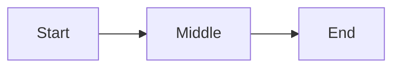

# Demo Document

## Overview

This fixture exercises **bold**, *italic*, ~~strike~~, `inline code`, and [a link](https://example.com).

### Subheading

A second paragraph with a [link](https://example.com).

> [!class1]
> A class-1 callout — short and to the point.

> [!class3]
> A class-3 callout with more text, useful when the message needs room.

## By the Numbers

```stats
:::class1
value: 87%
label: Coverage
description: Up 12 points
:::class2
value: 1.2M
label: Users
:::class3
value: 4.8
label: Rating
description: Out of 5
:::class4
value: 24/7
label: Uptime
```

### A small table

| Element | Syntax | Notes |
|---------|--------|-------|
| Title | `#` | Once at top |
| Section | `##` | Sidebar tab |
| Heading | `###` | In-tab |

## Flow

```linear
Prompt :::class1 -> Generate :::class2 -> Upload :::class3 -> Render :::class4
```



## Tasks

- [x] Lock the spec
- [x] Build the parser
- [ ] Build the renderer
- [ ] Theme it
- [ ] Ship it

### Code

```ts
function hello(name: string) {
	return `Hello, ${name}!`;
}
```
